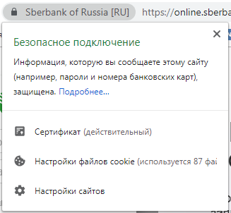
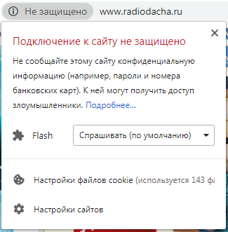

# Расскажите владельцу интернет-магазина, чем HTTP отличается от HTTPS.

HTTP – это протокол передачи данных между 
*сервером*
вашего интернет-магазина и 
*клиентом*
(браузер или приложение на телефоне). HTTPS – это расширение HTTP, в котором добавили шифрование данных. Это стало необходимым, когда встал вопрос о защите передаваемых данных (например, данных банковских карт при оплате в интернет-магазинах). Таким образом, при 
**правильном**
использовании HTTPS данные защищены от атак, основанных на прослушивании сетевого соединения.

Правильное использование HTTPS состоит в том, чтобы получить (= купить) в Центре сертификации (организация, чья честность неоспорима) сертификат открытого ключа для конкретно вашего сервера и установить его в систему. И не забывать продлять его раз в год.

Если вы все сделаете правильно, то посетители вашего интернет-магазина будут видеть значок «закрытого замка» перед строкой с адресом сайта:

 
А при нажатии на него покажется вот такое окно:

 
Тогда как иначе (при использовании HTTP) это будет выглядеть так: 

 
И тогда при нажатии на значок покажется вот такое окно:

 
Не сложно догадаться в каком случае люди будут более охотно покупать что-либо в вашем интернет-магазине.

Кроме того сайты с HTTPS лучше ранжируются поисковиками, такими как Google и Яндекс. Пока это не основной фактор ранжирования, но в свете массового перехода крупных (и не только) сайтов с HTTP на HTTPS это может стать критичным для вашего интернет-магазина.

### Подведем итоги
**Плюсы HTTPS в сравнении с HTTP:**
1.	Безопасная передача данных: никакие конфиденциальные данные пользователей не попадут в третьи руки.
2.	Доверие пользователей: при необходимости оплатить товар в интернет-магазине большинство пользователей обратят внимание на безопасность передачи подобных данных и скорее купят у вас, чем в другом месте, где о безопасности не побеспокоились. А если и не купят, то посоветуют другим.
3.	Увеличение доли покупателей среди посетителей сайта за счет большего доверия пользователей.
4.	Более высокая строчка в поисковой выдаче, так как использование HTTPS есть фактор ранжирования.

**Минусы:**
1.	Покупка сертификата и его ежегодное продление.
2.	Перевод сайта на HTTPS (полностью, иначе сайт остается уязвимым к атакам).
